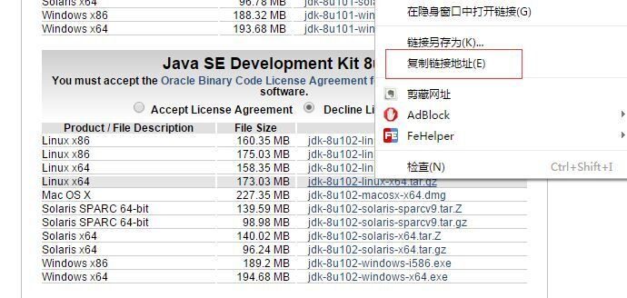
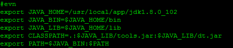

## server config
##### 1.java环境搭建
> **1.1** 下载相应的jdk版本 使用wget下载对应的包
> wget --no-check-certificate --no-cookies --header "Cookie: oraclelicense=accept-securebackup-cookie" {downloadUrl}
> 其中{downloadUrl}= 
> **1.2** 解压 tar -zxvf xxx.tar.gz
> **1.3** 配置环境变量
> vim ~/.bashrc
> 
> 

##### 2.下载tomcat安装 

##### 3.安装nginx  apt-get nginx